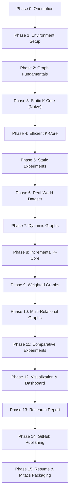

# Build Instructions: Generalized K-Core Analyzer (GKCA)

## Document Metadata

| Attribute | Details |
|---|---|
| **Companion File** | `Generalized_KCore_SRS.md` (Software Requirements Specification) |
| **Audience** | AI Build Agent (Antigravity) / Core Developer |
| **Author** | Kuldeep Gheghate — PCCOE, Pune |
| **Purpose** | Guide the build agent step-by-step through phased implementation. References the SRS for requirements while providing setup procedures, sequencing rules, and phase-by-phase execution instructions in plain language without raw source code. |

---

## Quick Reference Roadmap

| Phase | Name | SRS Requirements | Key Deliverable |
|:---:|---|:---:|---|
| **0** | Orientation | All sections | Agent summary & conceptual validation of GKCA |
| **1** | Environment Setup | Section 8 | Verified local development environment |
| **2** | Graph Fundamentals | FR-1 | Hand-constructed small reference graphs & statistics |
| **3** | Static K-Core (Naive) | FR-2 | `kcore_basic.py` (Iterative removal implementation) |
| **4** | Efficient K-Core | FR-3, FR-4 | `kcore_efficient.py` (Batagelj-Zaversnik & NetworkX validation) |
| **5** | Experiments (Static) | FR-10, FR-11 | Benchmarking tables & naive vs. efficient runtime charts |
| **6** | Real-World Dataset | FR-1 | Real dataset loading, degeneracy, and core distribution stats |
| **7** | Dynamic Graphs | FR-5 | `dynamic_kcore.py` (Edge mutations & candidate analysis) |
| **8** | Incremental K-Core | FR-6, FR-7 | Incremental maintenance verified against full recompute |
| **9** | Weighted Graphs | FR-8 | `weighted_kcore.py` (Strength / weighted core decomposition) |
| **10** | Multi-Relational Graphs | FR-9 | `multilayer_kcore.py` (Multiplex graph core decomposition) |
| **11** | Comparative Experiments | FR-10 | Comprehensive 4-axis comparative result tables |
| **12** | Visualization | FR-11, FR-12 | Interactive Streamlit dashboard & static visual figures |
| **13** | Research Report | FR-13 | Complete academic technical report referencing artifacts |
| **14** | GitHub Publishing | FR-13, FR-14 | Public GitHub repository, clean README, license, clean git history |
| **15** | Resume & Mitacs | — | Verified resume bullet points & Mitacs research narrative |

---

## Section 0. How to Use This File

1. **Source of Truth Division:** Treat `Generalized_KCore_SRS.md` as the authoritative source of truth for **requirements** (what each module must do, mathematical definitions, inputs/outputs, and acceptance criteria). Treat this file (`BUILD_INSTRUCTIONS.md`) as the authoritative source of truth for **sequencing** (execution order, gates, and stopping rules).
2. **Strict Sequential Execution:** Work through the phases in exact numerical order (0 through 15), one at a time. Never start a phase until the previous phase has been explicitly confirmed complete by the project owner.
3. **Explicit Confirmation Gate:** At the conclusion of each phase, stop execution, report the completed deliverables against the phase's **Definition of Done**, and wait for explicit confirmation (e.g., *"Phase N completed"*) before proceeding.
4. **No Premature Implementation:** Never skip ahead, never merge phases to "save time," and never implement components or algorithms from later phases early.
5. **Fail-Fast Error Handling:** If a step fails, a test breaks, or an unexpected error occurs, halt immediately. Report the exact error message and context, and wait for human guidance rather than improvising unverified workarounds.
6. **Explainability Requirement:** Every implemented module must be fully explainable. The build agent must be prepared to clearly articulate the data structures chosen, theoretical motivation, and asymptotic time and space complexities.

---

## Section 1. Non-Negotiable Ground Rules

> [!IMPORTANT]
> ### 1. Strict Scope Boundaries
> Do **not** introduce distributed computing frameworks, GPU/CUDA acceleration, Apache Spark, Deep Learning / Graph Neural Networks (GNNs), LLM components, production Neo4j database deployments, or million-node datasets. These remain strictly out of scope unless explicitly amended by the project owner.

> [!IMPORTANT]
> ### 2. No Borrowed Implementations
> Third-party libraries such as NetworkX are strictly used as reference oracles for validating correctness and benchmarks. They must **never** be used as a substitute for the project's own algorithmic implementations.

> [!IMPORTANT]
> ### 3. No Premature Library Installation
> Only install dependencies required for the current active phase as specified in SRS Section 8.4. Do not pre-install dashboard or visualization libraries during early algorithmic stages.

> [!IMPORTANT]
> ### 4. Mandatory Ground-Truth Validation
> Every newly implemented algorithm variant must be verified against its defined baseline (naive vs. efficient, incremental vs. full recomputation, or NetworkX reference outputs) before it is marked complete.

> [!IMPORTANT]
> ### 5. No Premature Dashboard Construction
> The Streamlit interactive user interface is built only in Phase 12, after all underlying algorithms have been completely implemented, tested, and validated.

> [!IMPORTANT]
> ### 6. Single Phase Confirmation Discipline
> Each phase concludes with a structured summary and an explicit pause awaiting the project owner's confirmation.

---

## Section 2. Before Phase 1 — Orientation

Before creating any project files or writing code, read `Generalized_KCore_SRS.md` in full, paying special attention to:
- **Section 1.3 (Definitions):** Establish consistent graph theory and k-core terminology.
- **Section 3 (System Features / FR-1 to FR-14):** Master module specifications and acceptance criteria.
- **Section 6 (System Architecture):** Understand the 4-layer architecture:
  $$\text{Data Layer} \longrightarrow \text{Algorithm Layer} \longrightarrow \text{Experimentation Layer} \longrightarrow \text{Presentation Layer}$$
- **Section 9 (Project Directory Structure):** Understand target file paths and naming conventions.
- **Section 10 (Development Roadmap):** Review the 15 developmental milestones and exit criteria.

> **Exit Criteria for Phase 0:** The agent can synthesize and articulate in plain language what GKCA is, why it is being built, and how it aligns with the Mitacs Globalink / DSA research narrative. **Do not create project code or data files during Phase 0.**

---

## Section 3. Phase-by-Phase Instructions

### Phase 1 — Environment Setup
**Goal:** Establish a clean, verified local development environment without creating project-specific algorithmic files.

**Do:**
- Confirm Python (3.11 or 3.12, 64-bit), VS Code, and Git are installed and available on `PATH`. Install any missing prerequisites per SRS Section 8.2.
- Create the project root directory and open it in VS Code.
- Initialize and activate a project-local virtual environment (`.venv`).
- Install only **Stage-1** libraries listed in SRS Section 8.4.1 (core numerical, graph reference, tabular data, and static plotting tools: `networkx`, `numpy`, `pandas`, `matplotlib`, `scipy`).
- Configure VS Code Python and Jupyter extensions to target the project virtual environment.
- Run a smoke test confirming all Stage-1 libraries import correctly and display expected versions.
- Initialize a local Git repository (`git init`) and configure standard `.gitignore`.

**Do Not:**
- Write any k-core algorithmic logic.
- Install Stage-2 visualization/dashboard libraries (e.g., Streamlit, PyVis).
- Download external datasets or create the final project `README.md`.

> **Definition of Done:**
> Environment verification script executes cleanly, Git is initialized with a clean working tree, and no project logic files exist yet.

---

### Phase 2 — Graph Fundamentals
**Goal:** Confirm a complete, working understanding of fundamental graph data structures and create small reference graphs for manual correctness checks.

**Do:**
- Review core graph representations: adjacency lists, degree sequences, and graph traversal complexities ($O(V + E)$).
- Construct small, hand-crafted reference graphs (as isolated test data structures or literal edge lists):
  - Path graph, Cycle graph, Star graph, Complete graph ($K_4, K_5$), and a Disconnected / Multi-component graph.
- Manually compute and record descriptive graph statistics for each reference graph: node count $|V|$, edge count $|E|$, min/max/average degree, and connected component count.

**Do Not:**
- Implement k-core decomposition algorithms yet.
- Wire data loaders into production modules.

> **Definition of Done:**
> A set of hand-verified small graphs is documented with their exact topological properties and descriptive statistics ready for algorithmic testing.

---

### Phase 3 — Static K-Core From Scratch (Naive Algorithm)
**Goal:** Implement FR-2 — the iterative node-removal algorithm for static unweighted k-core decomposition.

**Do:**
- Manually trace and solve the k-core decomposition on at least one reference graph from Phase 2 for multiple values of $k$ (e.g., $k=1, 2, 3$) to produce exact manual solutions.
- Implement `src/kcore_basic.py` containing the naive iterative peeling algorithm:
  - Iteratively remove all vertices with degree $< k$.
  - Update remaining neighbor degrees upon each deletion until all remaining vertices satisfy $\text{deg}(v) \ge k$.
- Verify that `kcore_basic.py` produces outputs identical to the hand-calculated reference solutions.

**Do Not:**
- Implement the $O(V + E)$ Batagelj-Zaversnik optimization in this module.
- Rely on NetworkX inside `kcore_basic.py`.

> **Definition of Done:**
> `src/kcore_basic.py` runs successfully and produces 100% correct k-core subgraphs on every Phase 2 hand-verified graph.

---

### Phase 4 — Core Numbers & Efficient Implementation
**Goal:** Implement FR-3 (Batagelj-Zaversnik $O(V + E)$ algorithm) and FR-4 (NetworkX validation harness).

**Do:**
- Implement `src/kcore_efficient.py` using the linear-time Batagelj-Zaversnik algorithm:
  - Compute degrees and sort vertices into degree buckets in $O(V)$.
  - Maintain positional arrays (`pos`, `vert`, `deg`, `bin`) to achieve $O(1)$ vertex degree updates.
  - Sequentially peel vertices to compute the exact core number $c(v)$ for every vertex $v \in V$.
- Implement an automated validation test comparing `kcore_efficient.py` outputs against `networkx.core_number()` node-by-node.
- Execute validation on all Phase 2 reference graphs plus at least one larger synthetic graph (Erdős–Rényi / Barabási–Albert).

**Do Not:**
- Tolerate any discrepancy between the efficient implementation and the NetworkX reference oracle.

> **Definition of Done:**
> `src/kcore_efficient.py` passes all unit tests, producing core numbers matching `networkx.core_number()` on all test graphs with zero discrepancies.

---

### Phase 5 — Experiments (Static)
**Goal:** Benchmark naive vs. efficient static k-core implementations (FR-10 static slice) and generate runtime comparison charts (FR-11).

**Do:**
- Generate synthetic graphs of increasing scale and varying density ($|V| \in [100, 5000]$, $|E| \in [500, 25000]$).
- Measure and record execution runtimes for both `kcore_basic.py` ($O(V \cdot E)$ or $O(V^2)$) and `kcore_efficient.py` ($O(V + E)$).
- Store benchmark results in structured CSV/table format under `results/tables/static_benchmark.csv` (per SRS Section 7.3).
- Generate a runtime scaling plot ($x$-axis: graph size, $y$-axis: runtime in milliseconds) saved to `results/graphs/static_runtime_comparison.png`.

**Do Not:**
- Benchmark on non-synthetic or uncontrolled real-world graphs yet.
- Fabricate benchmark data or runtimes.

> **Definition of Done:**
> The resulting benchmark plot and CSV table clearly demonstrate the linear $O(V + E)$ scaling of the efficient algorithm outperforming the naive implementation as graph size increases.

---

### Phase 6 — Real-World Dataset
**Goal:** Execute the validated static algorithm on a real-world network dataset (FR-1 & FR-3).

**Do:**
- Acquire a standard, publicly available real-world dataset (e.g., Zachary Karate Club, Dolphins, Enron email sub-network, or Cora citation network) conforming to SRS Section 2.5 size limits ($|V| < 10{,}000$).
- Implement dataset ingestion within `src/graph_loader.py` to parse standard edge-list or adjacency formats into the project's internal graph representation.
- Compute global graph metrics: node count, edge count, density, graph degeneracy ($k_{\max} = \max_{v} c(v)$), and core number distribution.
- Document core distribution statistics in `results/tables/realworld_kcore_stats.csv`.

**Do Not:**
- Use multi-million-node graphs that exceed local compute boundaries.
- Modify the raw input dataset files.

> **Definition of Done:**
> The real-world dataset is parsed, its core numbers and degeneracy are computed and verified, and summary statistics are saved for technical report inclusion.

---

### Phase 7 — Dynamic Graphs
**Goal:** Implement FR-5 — graph mutation mechanics and affected candidate node identification.

**Do:**
- Implement `src/dynamic_kcore.py` with support for single-edge dynamic mutations:
  - `add_edge(u, v)`
  - `remove_edge(u, v)`
- Implement candidate discovery logic: identify the exact sub-network of nodes whose core numbers could theoretically change following an edge insertion or deletion based on core-number bounds ($c(u), c(v)$ and neighbor core numbers).
- Step through a concrete reference example demonstrating why specific vertices are in the candidate set while others remain unaffected.

**Do Not:**
- Perform full-graph recalculation inside the candidate identification step.
- Implement incremental propagation logic yet (reserved for Phase 8).

> **Definition of Done:**
> `src/dynamic_kcore.py` accurately identifies and logs the theoretical candidate vertex set for both edge addition and edge removal on test graphs.

---

### Phase 8 — Incremental K-Core
**Goal:** Implement FR-6 (full-recompute baseline) and FR-7 (incremental k-core maintenance), proving exact equivalence and performance gains.

**Do:**
- Implement the full recomputation baseline (re-invoking Phase 4 Batagelj-Zaversnik across the entire graph following each mutation).
- Implement the incremental maintenance algorithm in `src/dynamic_kcore.py` (updating core numbers only across affected candidate subgraphs).
- Execute randomized sequences of edge additions and deletions, asserting that `incremental_core_numbers == full_recompute_core_numbers` after every single mutation.
- Benchmark and record wall-clock runtimes of incremental updates versus full recomputations across non-trivial synthetic graphs ($|V| \ge 1{,}000$).

**Do Not:**
- Mark Phase 8 complete if there is even a single mismatch between incremental and full recomputation.

> **Definition of Done:**
> Incremental maintenance produces 100% identical core numbers to full recomputation across all test mutation sequences, with incremental execution time demonstrating measurable speedups over full recomputation.

---

### Phase 9 — Weighted Graphs
**Goal:** Implement FR-8 — the generalized weighted k-core decomposition algorithm based on node strength.

**Do:**
- Extend graph representation to support positive real-valued edge weights $w(e) \in \mathbb{R}^+$.
- Implement vertex strength calculation:
  $$s(u) = \sum_{v \in N(u)} w(u, v)$$
- Implement `src/weighted_kcore.py` to iteratively decompose the graph based on node strength thresholds ($s(v) < k_w$).
- Run weighted core decomposition across a weighted graph, comparing results against unweighted k-core decomposition on the identical topology to prove that edge weights alter the core hierarchy in an explainable way.

**Do Not:**
- Support negative edge weights (strictly out of scope).
- Confuse unweighted degree with weighted strength.

> **Definition of Done:**
> `src/weighted_kcore.py` correctly calculates weighted core decomposition, with test comparisons showing meaningful, documented differences between unweighted and weighted core hierarchies.

---

### Phase 10 — Multi-Relational Graphs
**Goal:** Implement FR-9 — multi-relational / multiplex k-core decomposition.

**Do:**
- Implement a multiplex graph structure supporting multiple distinct edge relationship types (layers) $L = \{l_1, l_2, \dots, l_m\}$.
- Implement `src/multilayer_kcore.py` supporting configurable layer combination rules:
  - *Layer Filtering:* Compute k-core on selected relationship subgraphs $G_{l_i}$.
  - *Joint / Composite Core Decomposition:* Joint degree constraints across multiple layers (e.g., $d_{l_1}(v) \ge k_1 \land d_{l_2}(v) \ge k_2$).
- Document and verify how vertex core numbers shift when analyzing single layers versus combined multiplex layers.

**Do Not:**
- Hardcode layer types or limit the module to a single fixed relationship schema.

> **Definition of Done:**
> `src/multilayer_kcore.py` executes multiplex decomposition, and test cases demonstrate predictable core structure shifts across varying relationship filters.

---

### Phase 11 — Comparative Experiments
**Goal:** Complete all 4 benchmarking axes specified in FR-10 and save unified experimental tables.

**Do:**
- Execute and record experiments across all four comparison dimensions:
  1. **Static Benchmarking:** Naive iterative removal vs. Efficient Batagelj-Zaversnik.
  2. **Dynamic Benchmarking:** Incremental maintenance vs. Full recomputation across mutation streams.
  3. **Weighted vs. Unweighted:** Structural differences in core hierarchy induced by edge weights.
  4. **Single-Relation vs. Multi-Relational:** Core shifts between isolated layers and composite multiplex configurations.
- Save structured CSV tables under `results/tables/` matching SRS Section 7.3 specifications.

**Do Not:**
- Leave any of the four experimental axes incomplete or contradictory to earlier phase outputs.

> **Definition of Done:**
> Complete, structured CSV result tables for all four comparison dimensions exist under `results/tables/` with zero internal data contradictions.

---

### Phase 12 — Visualization
**Goal:** Implement FR-11 (static plots) and FR-12 (interactive Streamlit dashboard).

**Do:**
- Install Stage-2 visualization dependencies (`streamlit`, `pyvis`, `plotly`, `altair`).
- Finalize static visualization scripts under `src/visualize.py` (core distribution histograms, node-link diagrams colored by core number, runtime scaling plots).
- Build the Streamlit web dashboard in `app.py` following SRS Section 4.1 UI specifications:
  - Top metric cards: Total Nodes, Total Edges, Graph Degeneracy ($k_{\max}$).
  - Sidebar controls: Dataset selector, $k$-threshold slider, Layer/Relationship filter.
  - Dynamic mutation panel: Add Edge / Remove Edge inputs with interactive trigger buttons.
  - Main panel: Interactive node-link graph visualization colored by core number.
  - Side-by-side performance panel: Real-time execution time comparison (Incremental vs. Full Recomputation).
- Ensure strict architecture separation: `app.py` must only call the Algorithm Layer modules and perform zero algorithmic logic internally.

**Do Not:**
- Place algorithmic graph processing logic directly inside `app.py`.
- Introduce external web frameworks outside Streamlit.

> **Definition of Done:**
> The Streamlit application launches locally via `streamlit run app.py`, runs without console errors, and cleanly provides all interactive features specified in SRS Section 4.1.

---

### Phase 13 — Research Report
**Goal:** Implement FR-13's research report component.

**Do:**
- Author `docs/RESEARCH_REPORT.md` following academic publication standards.
- Include all required sections:
  1. Abstract & Problem Statement
  2. Mathematical Formulations (Static, Dynamic, Weighted, Multiplex)
  3. Algorithmic Implementations & Complexity Analysis
  4. Experimental Setup & Benchmarks (referencing actual CSVs and figures)
  5. Results Discussion & Key Insights
  6. Limitations & Future Scope
- Verify that all numerical results, charts, and table references correspond exactly to generated project artifacts.

**Do Not:**
- Include unverified claims, fabricated benchmark numbers, or features not implemented in the repository.

> **Definition of Done:**
> `docs/RESEARCH_REPORT.md` is complete, professional, fully cited, and 100% consistent with experimental code and benchmark outputs.

---

### Phase 14 — GitHub Publishing
**Goal:** Complete FR-13's README component and FR-14 repository packaging for public release.

**Do:**
- Finalize the top-level `README.md` containing:
  - Project Overview & Architecture Diagram
  - Quick Start & Installation Guide
  - Feature Showcase with embedded screenshots of the Streamlit dashboard and benchmark plots
  - Benchmark Summary Tables
  - License & Citation Information
- Add an open-source `LICENSE` file (MIT or Apache 2.0).
- Confirm repository cleanliness: remove temporary caches (`__pycache__`, `.pytest_cache`), verify `.gitignore`, and validate structure against SRS Section 9.
- Push the complete Git commit history to a public GitHub repository.

**Do Not:**
- Commit temporary files, sensitive virtual environment binaries, or IDE metadata.
- Flatten or rewrite the incremental multi-phase Git commit history into a single monolithic commit.

> **Definition of Done:**
> A new user can clone the public repository, follow `README.md` step-by-step, and have the full test suite and Streamlit dashboard running without errors or external guidance.

---

### Phase 15 — Resume & Mitacs Application
**Goal:** Package project achievements into verified resume bullet points and Mitacs Globalink research narrative.

**Do:**
- Synthesize technical achievements into high-impact, verifiable resume bullet points reflecting implemented algorithms, optimizations, and benchmarks (referencing SRS Section 12).
- Draft the Mitacs Globalink Statement of Interest narrative:
  - Connect DSA foundations (Batagelj-Zaversnik $O(V + E)$ algorithm, dynamic graph algorithms) with research applications.
  - Bridge GKCA insights with the candidate's existing IEEE ICISC-2026 research publication background.
- Review all statements to ensure total truthfulness against the completed repository.

**Do Not:**
- Overstate capabilities or list out-of-scope technologies (e.g., claiming GNN or distributed Spark implementations).

> **Definition of Done:**
> Complete, truthful, and compelling resume bullet points and Mitacs statement-of-interest draft are saved under `docs/MITACS_NARRATIVE.md`.

---

## Section 4. Sequencing Rule (Recap)

The sequence of implementation is mathematically and architecturally constrained. You must respect this exact dependency order:



```
Static K-Core (Naive -> Efficient)
  └──> Dynamic K-Core (Mutations -> Incremental Maintenance)
         └──> Weighted K-Core (Node Strength Decomposition)
                └──> Multi-Relational K-Core (Multiplex Layers)
                       └──> Performance Evaluation (4-Axis Benchmarks)
                              └──> Visualization (Streamlit UI)
                                     └──> Documentation & Technical Report
                                            └──> GitHub Publishing & Narrative
```

> [!WARNING]
> **Do not reorder this sequence.** Later modules (dynamic incremental maintenance, weighted decomposition, multiplex analysis) are generalizations that directly depend on earlier foundational modules being fully validated and functionally frozen.

---

## Section 5. What "Complete" Means for This File

This instructions file is considered **fully applied and satisfied** when and only when:
1. All 16 phases (Phase 0 through Phase 15) have been executed in strict sequence.
2. Every phase has received explicit human confirmation before the subsequent phase commenced.
3. Every individual phase deliverable fulfills its designated **Definition of Done**.
4. The entire codebase, test suite, visual dashboard, and documentation satisfy the formal Acceptance Criteria defined in **SRS Section 11.4**.
