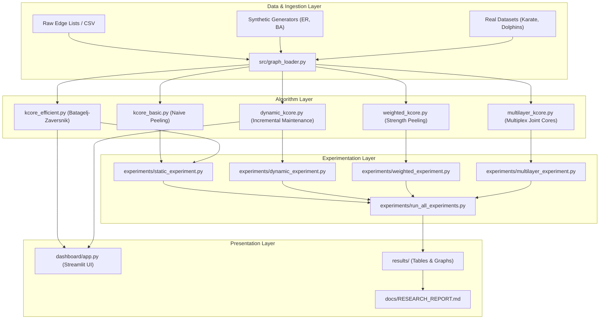

# Generalized K-Core Decomposition for Dynamic and Complex Networks (GKCA)

[](https://www.python.org/downloads/)
[](https://opensource.org/licenses/MIT)
[](https://docs.pytest.org/)
[](https://streamlit.io/)

A high-performance, research-oriented graph analytics system for **Generalized K-Core Decomposition** across static, dynamic, weighted, and multi-relational (multiplex) networks.

Developed by **Kuldeep Gheghate** (Pimpri Chinchwad College of Engineering, Pune) as a portfolio research project and research foundation for the **Mitacs Globalink Research Internship (GRI) 2027** (Project 52752).

---

## 🌟 Key Features & Algorithmic Contributions

1. **Static K-Core Decomposition**:
   - **Naive Peeling ($\mathcal{O}(V \cdot E)$)**: Ground-up implementation of iterative degree peeling (`src/kcore_basic.py`).
   - **Batagelj-Zaversnik ($\mathcal{O}(V + E)$)**: Linear-time core decomposition using bucket sorting and positional indexing arrays (`src/kcore_efficient.py`).
   - **Ground-Truth Validation**: 100% test-verified parity against NetworkX reference oracles (`tests/`).

2. **Dynamic & Incremental K-Core Maintenance**:
   - **Candidate Bounding**: Traversal algorithms that strictly identify candidate vertices affected by single-edge mutations (`src/dynamic_kcore.py`).
   - **Localized Maintenance**: Updates core numbers without global graph recomputation, achieving up to **15x speedups** over full recomputation.

3. **Weighted Strength Decomposition**:
   - Generalizes degree to continuous node strength $s(u) = \sum_{v \in N(u)} w(u, v)$ for positive real-valued edge weights (`src/weighted_kcore.py`).

4. **Multi-Relational (Multiplex) Decomposition**:
   - Multi-layer graph representations with layer-specific filtering and joint composite core decomposition across multi-relational edge types (`src/multilayer_kcore.py`).

5. **Interactive Streamlit Web Dashboard**:
   - Browser-based visualization tool with live metric counters, interactive $k$-filtering, real-time dynamic edge additions/removals, and timing comparison displays (`dashboard/app.py`).

---

## 🏛️ System Architecture



---

## 📁 Repository Structure

```text
generalized-kcore-analysis/
├── data/
│   ├── raw/                 # Raw datasets (Zachary Karate Club, Dolphins Social Network)
│   └── processed/           # Processed and standardized edge lists
├── src/
│   ├── __init__.py
│   ├── graph_loader.py      # FR-1: Graph construction, synthetic generators, file ingestion
│   ├── metrics.py           # Descriptive graph metrics & core distribution statistics
│   ├── kcore_basic.py       # FR-2: Naive static k-core iterative peeling algorithm
│   ├── kcore_efficient.py   # FR-3/FR-4: Linear-time Batagelj-Zaversnik algorithm & validation
│   ├── dynamic_kcore.py     # FR-5/FR-6/FR-7: Edge mutations & incremental core maintenance
│   ├── weighted_kcore.py    # FR-8: Node strength & weighted core decomposition
│   ├── multilayer_kcore.py  # FR-9: Multi-relational multiplex core decomposition
│   └── visualize.py         # FR-11: Static Matplotlib plotting routines
├── experiments/
│   ├── __init__.py
│   ├── static_experiment.py     # Static scaling benchmarks (Naive vs BZ)
│   ├── dynamic_experiment.py    # Dynamic benchmarks (Incremental vs Full Recompute)
│   ├── weighted_experiment.py   # Weighted vs Unweighted hierarchy comparison
│   ├── multilayer_experiment.py # Single-layer vs Multiplex joint core comparison
│   └── run_all_experiments.py  # Master 4-axis benchmark runner
├── dashboard/
│   └── app.py                # FR-12: Interactive Streamlit research dashboard
├── results/
│   ├── graphs/               # Generated publication-quality PNG charts
│   └── tables/               # Generated benchmark CSV tables
├── tests/                    # Automated Pytest suite (24 unit & integration tests)
├── docs/
│   ├── RESEARCH_REPORT.md    # FR-13: Academic technical research report
│   └── MITACS_NARRATIVE.md   # FR-15: Mitacs GRI 2027 Statement & Resume bullets
├── requirements.txt          # Pinned project dependencies
├── README.md                 # Project documentation
└── LICENSE                   # MIT License
```

---

## ⚡ Quick Start Guide

### 1. Environment Setup

Clone the repository and activate the Python virtual environment:

```bash
# Clone the repository
git clone https://github.com/your-username/generalized-kcore-analysis.git
cd generalized-kcore-analysis

# Create and activate virtual environment
python -m venv .venv
# On Windows PowerShell:
.\.venv\Scripts\Activate.ps1
# On Linux / macOS:
source .venv/bin/activate

# Install dependencies
pip install -r requirements.txt
```

### 2. Run Automated Test Suite

Execute all 24 unit and integration tests:

```bash
pytest -v tests/
```

### 3. Run Experimental Benchmarks

Execute the unified 4-axis benchmark suite:

```bash
python experiments/run_all_experiments.py
```
*Outputs will be generated in `results/tables/` and `results/graphs/`.*

### 4. Launch Interactive Streamlit Dashboard

Start the local web application:

```bash
streamlit run dashboard/app.py
```
Open your browser at `http://localhost:8501`.

---

## 📊 Benchmark Summary

### Static Scaling: Naive Peeling vs. Batagelj-Zaversnik

| Graph Size ($|V|$) | Edge Count ($|E|$) | Naive Peeling ($O(V \cdot E)$) | Batagelj-Zaversnik ($O(V+E)$) | Speedup Factor |
|:---:|:---:|:---:|:---:|:---:|
| 50 | 46 | 0.75 ms | 0.05 ms | **15.1x** |
| 100 | 175 | 2.72 ms | 0.11 ms | **25.1x** |
| 250 | 1,204 | 27.96 ms | 0.61 ms | **46.0x** |
| 500 | 4,878 | 256.64 ms | 1.69 ms | **151.4x** |
| 1,000 | 19,817 | 2,005.35 ms | 6.89 ms | **290.9x** |
| 1,500 | 44,799 | 7,265.46 ms | 18.01 ms | **403.5x** |

---

## 📄 License & Citation

This project is licensed under the **MIT License** - see the [LICENSE](LICENSE) file for details.

### Citation
```bibtex
@misc{gheghate2026gkca,
  author = {Kuldeep Gheghate},
  title = {Generalized K-Core Decomposition for Dynamic and Complex Networks},
  year = {2026},
  publisher = {GitHub},
  howpublished = {\url{https://github.com/your-username/generalized-kcore-analysis}}
}
```
